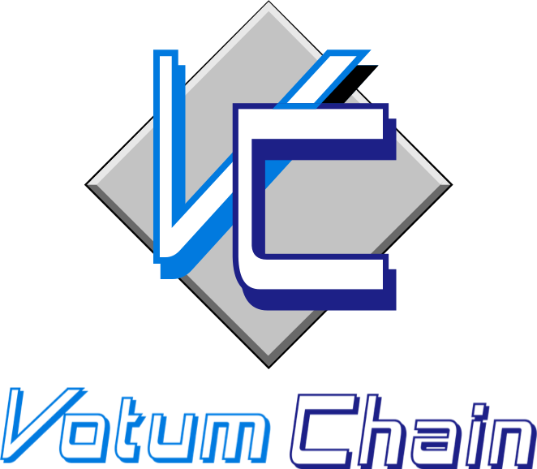

<p align="center">
  
</p>

# Get Started

```
$ git clone https://github.com/EG-easy/votumchain.git
cd votumchain
export GO111MODULE=on
make install
```

**Initialize configuration files and genesis file**
```
$ votumd init eguegu --chain-id testchain
```

**Copy the `Address` output here and save it for later use**
```
$ votumcli keys add jack
```

**Copy the `Address` output here and save it for later use**


**Add account with coins to the genesis file**

```
$ votumd add-genesis-account $(votumcli keys show jack -a) 1000votum,100000000stake
```


**Configure your CLI to eliminate need for chain-id flag**

```
$ votumcli config chain-id testchain
$ votumcli config output json
$ votumcli config indent true
$ votumcli config trust-node true
```

```
$ votumd gentx --name jack
$ votumd collect-gentxs
$ votumd validate-genesis
```


## Voting

### send Proposal 
```
$ votumcli tx gov submit-proposal --proposal="proposal/proposal.json" --from jack
```

## Use docker

```
$ docker build -t votum .
```

```
$ docker run --rm -it votum sh
```

```
$ docker exec -it votum sh
```


## License
Licensed under the [Apache v2 License](LICENSE).
